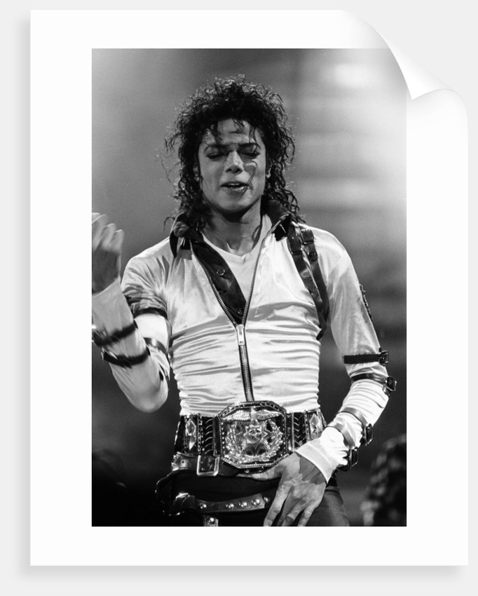

# About 
This repository will be about the change in music from 1990 to 2019 and how it has changed over time.
> **“Music gives a soul to the universe, wings to the mind, flight to the imagination and life to everything.”** ― *Plato*

# Popular Music

## 1. 1990's
* rap
* reggae
* contempory R&B
## 2000's 
* Southern Hip-Hop
* Alternative Rock
* 